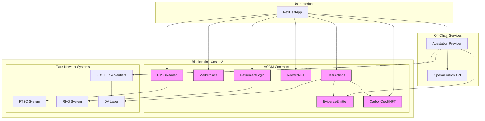
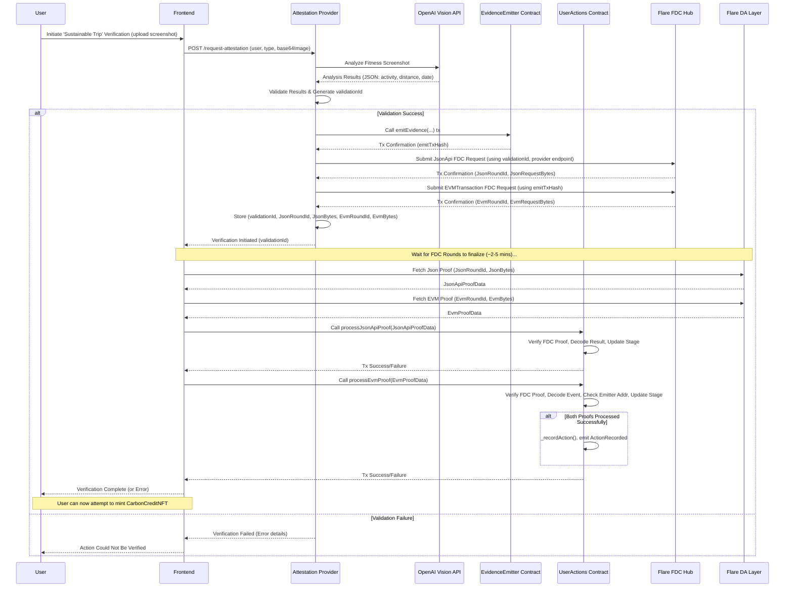
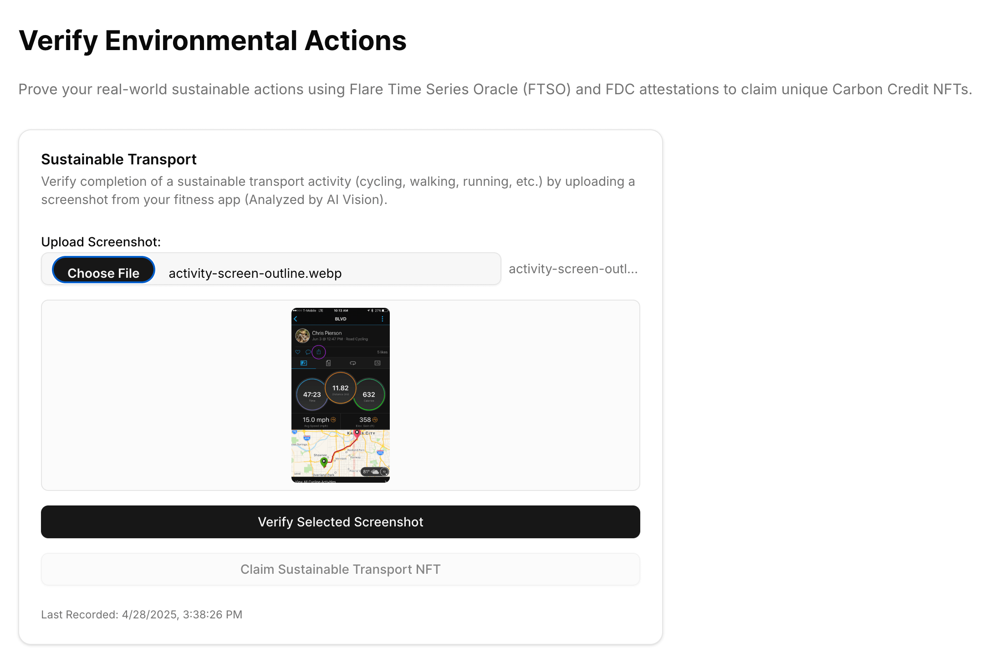
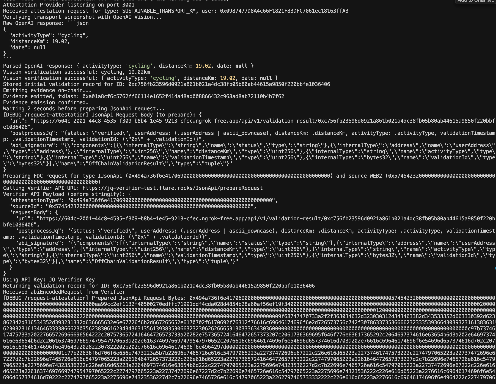
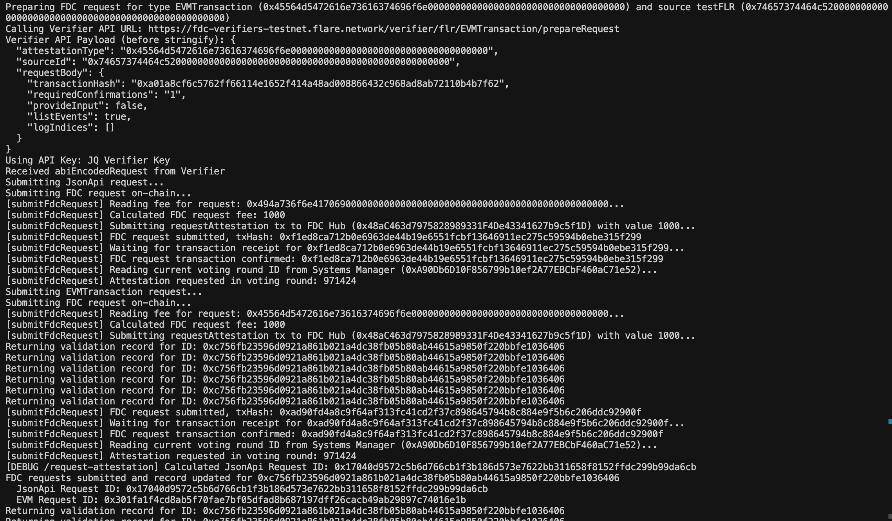
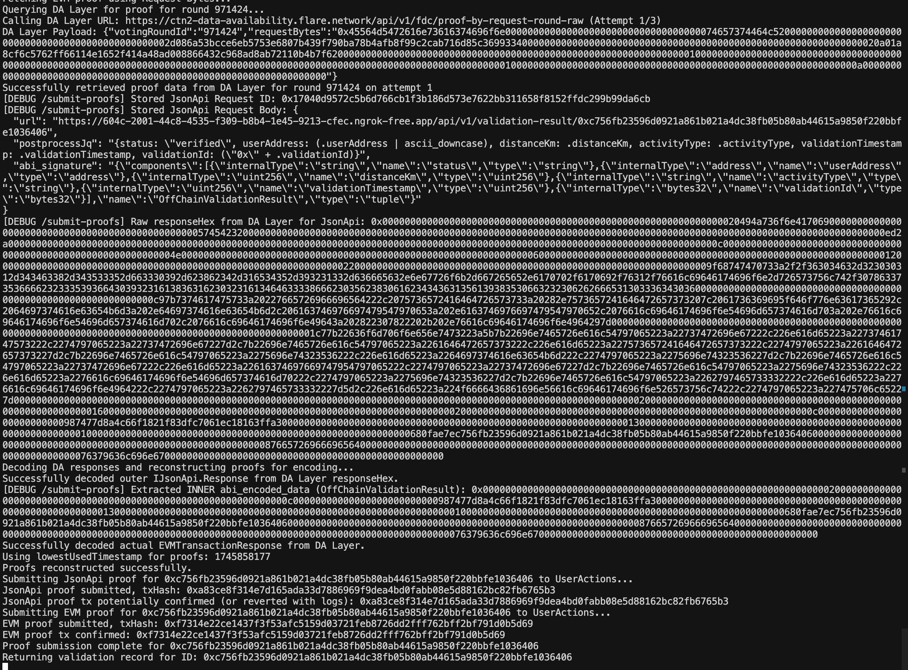
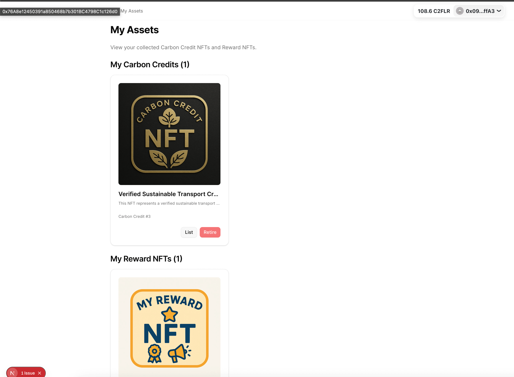
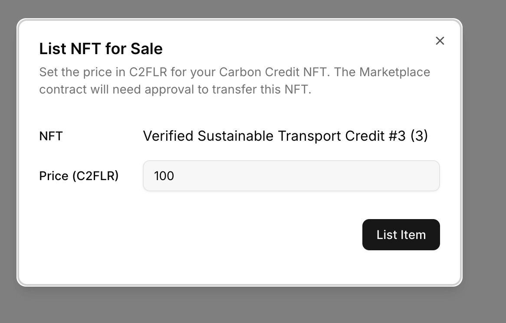
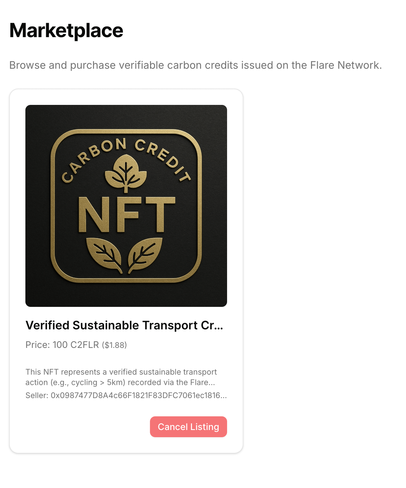

# VCOM - Verifiable Carbon Offset Marketplace

VCOM is a proof-of-concept decentralized application demonstrating a marketplace for verifiable carbon offset credits tokenized as NFTs on the Flare Network (Coston2 Testnet). It leverages Flare's unique protocols (FDC, FTSO, RNG) to enhance transparency and trust in the carbon market.

## Table of Contents

*   [Problem & Solution](#problem--solution)
*   [Technology Stack](#technology-stack)
*   [Overall Architecture](#overall-architecture)
    *   [Mermaid Diagram](#mermaid-diagram)
*   [Project Structure](#project-structure)
*   [Detailed Verification Flow (FDC + OpenAI Vision)](#detailed-verification-flow-fdc--openai-vision)
    *   [Flow Steps](#flow-steps)
    *   [Sequence Diagram](#sequence-diagram)
*   [Subsystems](#subsystems)
    *   [Contracts](#contracts-subsystem)
    *   [Frontend](#frontend-subsystem)
    *   [Attestation Provider](#attestation-provider-subsystem)
*   [Getting Started / Setup](#getting-started--setup)
    *   [Prerequisites](#prerequisites)
    *   [Installation](#installation)
    *   [Environment Configuration](#environment-configuration)
*   [Running the Project](#running-the-project)
    *   [Contracts](#contracts)
    *   [Attestation Provider](#attestation-provider)
    *   [Frontend](#frontend)
*   [Deployment](#deployment)
*   [Images of Demo](#demo)
*   [Flare Development Experience Notes](#flare-development-experience-notes)

## Problem & Solution

**Problem:** Traditional carbon offset markets often lack transparency and verifiable proof of impact. It can be difficult to track the lifecycle of a credit and ensure genuine environmental action has occurred.

**Solution:** VCOM leverages blockchain technology and Flare Network's unique protocols (FTSO, FDC, State Connector) to create a transparent and verifiable marketplace.
*   Carbon credits are tokenized as unique NFTs (ERC721).
*   Environmental actions required for minting credits are verified on-chain using FDC attestations referencing both off-chain data (validated via OpenAI Vision and served by an Attestation Provider endpoint) and on-chain events emitted by a dedicated `EvidenceEmitter` contract.
*   A decentralized marketplace allows peer-to-peer trading of these verified credits using FLR tokens.
*   Pricing incorporates real-time FLR/USD data from the Flare Time Series Oracle (FTSO).
*   Retiring credits (burning the NFT) is gamified with potential rewards (Reward NFTs) determined by Flare's RNG.

## Technology Stack

*   **Frontend:** Next.js, React, TypeScript, Tailwind CSS, shadcn/ui, wagmi, viem
*   **Contracts:** Solidity ^0.8.20, Foundry, OpenZeppelin, Flare Periphery Contracts
*   **Attestation Provider:** Node.js, TypeScript, Express, Viem, OpenAI API
*   **Blockchain:** Flare Network (Coston2 Testnet)
*   **Package Manager:** pnpm (using workspaces)

## Overall Architecture

The project follows a monorepo structure containing three main components:

1.  **Frontend:** A Next.js application providing the user interface for interacting with the marketplace, viewing NFTs, and initiating action verification.
2.  **Contracts:** Solidity smart contracts deployed on Coston2, defining the NFTs, marketplace logic, and verification handling (`UserActions`).
3.  **Attestation Provider:** An off-chain Node.js service responsible for validating user-submitted data (e.g., analyzing images with OpenAI Vision), emitting on-chain evidence events, submitting FDC requests, and serving validation data for FDC proofs.

### Mermaid Diagram



## Project Structure

This repository uses a pnpm monorepo structure:

```
.
├── frontend/           # Next.js dApp
├── contracts/          # Solidity smart contracts (Foundry)
├── attestation-provider/ # Node.js FDC Attestation Provider service
├── package.json        # Root package file
├── pnpm-workspace.yaml # pnpm workspace configuration
└── README.md           # This file
```

## Detailed Verification Flow (FDC + OpenAI Vision)

The verification of the "Sustainable Transport" action relies on a dual-attestation FDC process orchestrated by the Attestation Provider and finalized by the `UserActions` contract.

### Flow Steps

1.  **User Upload & Initial Validation:** The user uploads a fitness app screenshot via the frontend. The Attestation Provider (`attestation-provider/src/server.ts`) receives this, validates it using OpenAI Vision (checking for activity type like cycling/walking and distance >= 5km), and generates a unique `validationId`.
2.  **Emit Evidence Event:** The provider calls `emitEvidence` on the deployed **`EvidenceEmitter.sol`** contract. This transaction emits the `ValidationEvidence` event containing the `validationId` and validated details (user, distance, activity, timestamp). The hash of this transaction (`emitTxHash`) is recorded.
3.  **Submit JsonApi FDC Request:** The provider prepares and submits a `JsonApi` FDC request to the Flare FDC Hub. The `requestBody` references the provider's own API endpoint (`/api/v1/validation-result/{validationId}`) which serves the validated data (status, userAddress, distanceKm, etc.) associated with the `validationId`. It also includes the expected ABI signature for this data.
4.  **Submit EVMTransaction FDC Request:** The provider prepares and submits an `EVMTransaction` FDC request to the Flare FDC Hub, referencing the **`emitTxHash`** recorded in step 2. This request asks the FDC to verify the transaction's inclusion and retrieve the emitted `ValidationEvidence` event data.
5.  **Store FDC Request Info:** The provider stores the `validationId`, the corresponding FDC `roundId`s, and the `requestBytes` for both the JsonApi and EVMTransaction requests locally.
6.  **Wait for FDC:** Time must pass (typically a few minutes) for the Flare network to reach consensus on the attestations for the submitted rounds.
7.  **Fetch Proofs (Frontend):** After waiting (triggered by user action or polling), the frontend queries the Flare **DA Layer** API (`/api/v1/fdc/proof-by-request-round-raw`) using the stored `roundId` and `requestBytes` for *both* the JsonApi and EVMTransaction requests associated with the `validationId`.
8.  **Submit Proofs to Contract (Frontend):** The frontend calls:
    *   `processJsonApiProof(proof)` on `UserActions.sol` with the retrieved JsonApi proof.
    *   `processEvmProof(proof)` on `UserActions.sol` with the retrieved EVMTransaction proof.
9.  **Contract Verification & State Update:**
    *   `processJsonApiProof` verifies the FDC proof using Flare's on-chain libraries and decodes the `OffChainValidationResult` struct from the proof data.
    *   `processEvmProof` verifies the FDC proof, decodes the `ValidationEvidence` event, and crucially ensures this event was emitted by the correct `EvidenceEmitter` contract address configured in `UserActions`.
    *   Both functions update the internal `validationStages` mapping for the `validationId`. If a proof arrives and the other has already been processed, the stage transitions to `BothVerified`.
10. **Action Recorded:** Once *both* proofs are successfully processed for the same `validationId`, the stage becomes `BothVerified`, the internal `_recordAction` function is called (updating `lastActionTimestamp`), and an `ActionRecorded` event is emitted.
11. **NFT Minting Eligibility:** The user is now eligible to mint the `CarbonCreditNFT`, as `isActionVerified` on the NFT contract will return `true` when checking the `lastActionTimestamp` in `UserActions`.

### Sequence Diagram



## Subsystems

### Contracts Subsystem

*   **Location:** `contracts/`
*   **Description:** Contains all Solidity smart contracts built with Foundry. Defines the core logic for NFTs, the marketplace, FDC verification handling (`UserActions`), event emission (`EvidenceEmitter`), FTSO reading, and retirement logic.
*   **Details:** See `contracts/README.md` for detailed contract descriptions, setup, and usage specific to the contracts.

### Frontend Subsystem

*   **Location:** `frontend/`
*   **Description:** The Next.js user interface. Allows users to connect wallets, view NFTs and marketplace listings, initiate the verification process (uploading screenshots), trigger proof submission, and interact with contract functions (list, buy, retire).
*   **Details:** (Add link to `frontend/README.md` if it exists)

### Attestation Provider Subsystem

*   **Location:** `attestation-provider/`
*   **Description:** A Node.js/Express backend service responsible for the off-chain parts of the verification flow. It handles image analysis via OpenAI, emits evidence events, submits FDC requests, and provides an API endpoint for the JsonApi FDC request.
*   **Details:** (Add link to `attestation-provider/README.md` if it exists)

## Getting Started / Setup

### Prerequisites

*   **Node.js:** v18 or later recommended.
*   **pnpm:** For managing packages in the monorepo. Install via `npm install -g pnpm`.
*   **Foundry:** Required for contract development. Follow installation guide: [https://book.getfoundry.sh/getting-started/installation](https://book.getfoundry.sh/getting-started/installation)
*   **Git:** For cloning the repository.
*   **Flare Account:** A wallet address with Coston2 C2FLR test tokens for deployment and interaction.
*   **API Keys:**
    *   OpenAI API Key
    *   Flare FDC API Key (for submitting attestations and querying DA Layer)
    *   Flare JQ Verifier API Key (used by `prepareRequest` for JsonApi)

### Installation

1.  **Clone the Repository:**
    ```bash
    git clone <your-repo-url>
    cd VCOM # Navigate to the project root
    ```
2.  **Install Dependencies:** Use pnpm to install dependencies for all workspaces (frontend, contracts, attestation-provider).
    ```bash
    pnpm install
    ```
3.  **Install Contract Libraries:** Navigate to the contracts directory and install Solidity libraries.
    ```bash
    cd contracts
    forge install
    cd .. # Return to root
    ```

### Environment Configuration

You need to create `.env` files in several directories:

1.  **`contracts/.env`:** For deployment.
    ```dotenv
    PRIVATE_KEY=0xYOUR_DEPLOYER_PRIVATE_KEY_HERE
    COSTON2_RPC_URL=https://coston2-api.flare.network/ext/C/rpc # Or your preferred RPC
    # Optional: BLOCKSCOUT_API_KEY=YOUR_COSTON2_EXPLORER_API_KEY # For verification if needed
    ```

2.  **`attestation-provider/.env`:** For running the provider service.
    ```dotenv
    PROVIDER_PRIVATE_KEY=0xYOUR_PROVIDER_WALLET_PRIVATE_KEY_HERE # Wallet for emitting evidence & submitting FDC txs
    COSTON2_RPC_URL=https://coston2-api.flare.network/ext/C/rpc
    OPENWEATHERMAP_API_KEY=DUMMY_VALUE # Replace if using weather action
    FDC_VERIFIER_BASE_URL=https://fdc-verifiers-testnet.flare.network
    FDC_HUB_ADDRESS=0x856bA450C63A39574E4F18A84054F5e9F50C3488 # Coston2 FDC Hub
    FDC_API_KEY=YOUR_FLARE_FDC_API_KEY_HERE
    JQ_VERIFIER_API_KEY=YOUR_FLARE_JQ_VERIFIER_API_KEY_HERE # Often same as FDC key
    USER_ACTIONS_ADDRESS=DEPLOYED_USER_ACTIONS_CONTRACT_ADDRESS_HERE # Fill after deployment
    EVIDENCE_EMITTER_ADDRESS=DEPLOYED_EVIDENCE_EMITTER_CONTRACT_ADDRESS_HERE # Fill after deployment
    OPENAI_API_KEY=YOUR_OPENAI_API_KEY_HERE
    PROVIDER_PUBLIC_BASE_URL=http://localhost:3001 # Or your deployed provider URL
    DA_LAYER_BASE_URL=https://coston2-dalayer.flare.network
    PROVIDER_PORT=3001 # Optional: Default is 3001
    FLARE_SYSTEMS_MANAGER_ADDRESS=0x856bA450C63A39574E4F18A84054F5e9F50C3488 # Coston2 SystemsManager
    FDC_FEE_CONFIG_ADDRESS=0x326E5D445F026F9FB57F6037071196E6B186B1a5 # Coston2 FdcFeeConfiguration
    ```

3.  **`frontend/.env.local`:** For the Next.js app.
    ```dotenv
    # Required by Next.js / wagmi - can be any valid URL
    NEXT_PUBLIC_WALLETCONNECT_PROJECT_ID=YOUR_WALLETCONNECT_PROJECT_ID_HERE # Get from https://cloud.walletconnect.com/

    # Attestation Provider URL
    NEXT_PUBLIC_ATTESTATION_PROVIDER_URL=http://localhost:3001 # Or your deployed provider URL
    ```

## Running the Project

Run each component in separate terminals from the **project root directory**.

### Contracts

1.  **Compile:**
    ```bash
    cd contracts
    forge build
    cd ..
    ```
2.  **Test:**
    ```bash
    cd contracts
    forge test
    cd ..
    ```
3.  **Deploy (See Deployment section below first)**

### Attestation Provider

1.  Ensure `attestation-provider/.env` is configured with deployed contract addresses (`UserActions`, `EvidenceEmitter`) and API keys.
2.  Start the provider:
    ```bash
    pnpm --filter attestation-provider dev # For development with hot-reloading
    # OR
    pnpm --filter attestation-provider build
    pnpm --filter attestation-provider start # For production build
    ```
    The provider will run on `http://localhost:3001` (or the port specified in `.env`).

### Frontend

1.  Ensure `frontend/.env.local` is configured with deployed contract addresses and the Attestation Provider URL.
2.  Start the frontend development server:
    ```bash
    pnpm --filter frontend dev
    ```
    The frontend will be available at `http://localhost:3000`.

## Deployment

1.  **Deploy Contracts:**
    *   Make sure `contracts/.env` has your `PRIVATE_KEY`.
    *   Update `contracts/script/DeployVCOM.s.sol` to deploy `EvidenceEmitter` and pass its address to the `UserActions` constructor.
    *   Run the deploy script from the `contracts` directory:
        ```bash
        cd contracts
        source .env # Load private key
        forge script script/DeployVCOM.s.sol:DeployVCOM --rpc-url coston2 --broadcast --verify --verifier blockscout --verifier-url https://coston2-explorer.flare.network/api/
        cd ..
        ```
    *   Note the deployed addresses.
2.  **Update `.env` Files:** Fill in the deployed contract addresses in `attestation-provider/.env` and `frontend/.env.local`.
3.  **Deploy Attestation Provider:** Deploy the `attestation-provider` service to a cloud platform (e.g., Google Cloud Run, AWS Lambda, Heroku, Render). Ensure the environment variables are set correctly in the deployment environment. Update `PROVIDER_PUBLIC_BASE_URL` in its `.env` and `NEXT_PUBLIC_ATTESTATION_PROVIDER_URL` in `frontend/.env.local` to the deployed URL.
4.  **Deploy Frontend:** Deploy the `frontend` Next.js application to a platform like Vercel or Netlify. Ensure the environment variables (contract addresses, provider URL) are configured in the deployment settings.

## Images of Demo


- verify sustain transportation with FDC(OpenAI Vision API + EVM(Flare))


- submit OpenAPI response to JSON API of FDC attestation


- attestation flow of JSON API and EVM


- query DA Layer from Frontend and submit proof


- My Assets page contain Carbon Credit NFT and Reward NFT


- List Carbon Credit NFT in Marketplace


- Marketplace show Carbon Credit NFT price in FLR and USD value

processJsonApiProof transaction \
https://coston2-explorer.flare.network/tx/0xa83ce8f314e7d165ada33d7886969f9dea4bd0fabb08e5d88162bc82fb6765b3

claimTransportNFT transaction \
https://coston2-explorer.flare.network/tx/0xea162661009ed4f84d4f9b81986d1d7abea719c747a965138b81e58cb00d24e6

listItem NFT transaction \
https://coston2-explorer.flare.network/tx/0x55c8f96495a3471e90162733086811fd8c77045d848d70e5a354fb3a625fc9c0

buyItem NFT transaction \
https://coston2-explorer.flare.network/tx/0xd9bd9360511da6087c0e583bf086d71e35375cb1d21130129e0fdd1a3e65a174

## Flare Development Experience Notes

*   **FDC Complexity:** The dual-attestation flow, while powerful, adds significant complexity involving off-chain coordination, multiple FDC requests, proof fetching from the DA layer, and on-chain proof submission/verification. Careful state management in both the provider and the contract (`UserActions`) is crucial.
*   **API Key Management:** Handling multiple API keys (OpenAI, FDC, JQ Verifier) securely requires careful environment configuration.
*   **DA Layer Interaction:** Fetching proofs requires understanding the specific DA Layer API endpoints and request/response formats. Retry logic is recommended as proofs might not be immediately available.
*   **Tooling:** Foundry provides a robust environment for contract development and testing. Viem is excellent for frontend and backend interactions. Flare's periphery contract library simplifies interaction with FTSO, RNG etc.
*   **Documentation:** Flare documentation is comprehensive but navigating the specifics of FDC proof construction, verification interfaces, and DA layer interaction requires careful reading. Examples are very helpful.
