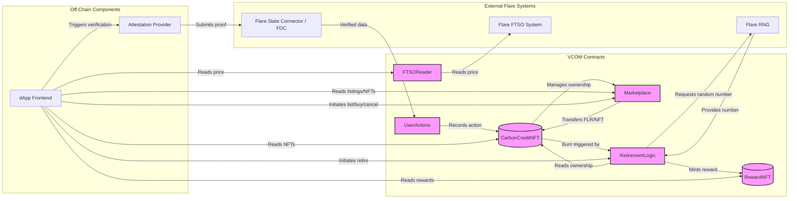

# VCOM Contracts - Verifiable Carbon Offset Marketplace

This directory contains the Solidity smart contracts for the Verifiable Carbon Offset Marketplace (VCOM) project, built using Foundry for the Flare Network (Coston2 Testnet).

## Table of Contents

*   [Problem & Solution](#problem--solution)
*   [Technical Overview](#technical-overview)
*   [Architecture](#architecture)
    *   [Mermaid Diagram](#mermaid-diagram)
*   [Project Structure](#project-structure)
*   [Getting Started](#getting-started)
    *   [Prerequisites](#prerequisites)
    *   [Installation](#installation)
*   [Usage](#usage)
    *   [Configuration](#configuration)
    *   [Compile](#compile)
    *   [Test](#test)
    *   [Deploy](#deploy)

## Problem & Solution

**Problem:** Traditional carbon offset markets often lack transparency and verifiable proof of impact. It can be difficult to track the lifecycle of a credit and ensure genuine environmental action has occurred.

**Solution:** VCOM leverages blockchain technology and Flare Network's unique protocols (FTSO, FDC, State Connector) to create a transparent and verifiable marketplace.
*   Carbon credits are tokenized as unique NFTs (ERC721).
*   Environmental actions required for minting credits can be verified on-chain using external data sources via the Flare State Connector and FDC Attestation Provider.
*   A decentralized marketplace allows peer-to-peer trading of these verified credits using FLR tokens.
*   Pricing incorporates real-time FLR/USD data from the Flare Time Series Oracle (FTSO).
*   Retiring credits (burning the NFT) is gamified with potential rewards (Reward NFTs) determined by Flare's RNG.

## Technical Overview

*   **Blockchain:** Flare Network (Coston2 Testnet for development/testing)
*   **Smart Contracts:** Solidity ^0.8.20
*   **Development Framework:** Foundry
*   **Key Flare Protocols:**
    *   **FTSO (Flare Time Series Oracle):** Used via `FTSOReader.sol` to get reliable FLR/USD price data.
    *   **State Connector & FDC:** Intended for use with `UserActions.sol` to verify off-chain environmental actions via external APIs (Attestation Provider implementation is separate).
    *   **Flare RNG:** Used within `RetirementLogic.sol` for gamified retirement rewards.
*   **Token Standards:** ERC721 (OpenZeppelin implementation) for Carbon Credit NFTs and Reward NFTs.
*   **Access Control:** OpenZeppelin `Ownable` and potentially `AccessControl` where needed.

## Architecture

The core contract system consists of the following interconnected components:

1.  **`CarbonCreditNFT.sol`**: An ERC721 contract representing the verifiable carbon credits. Mints NFTs based on verified actions recorded in `UserActions`. Includes logic for transferring and burning (retiring) NFTs, controlled by `Marketplace` and `RetirementLogic` respectively.
2.  **`Marketplace.sol`**: Facilitates the listing, buying, and cancelling of `CarbonCreditNFT` listings using FLR as the payment currency. Interacts with `CarbonCreditNFT` for ownership transfers.
3.  **`UserActions.sol`**: Stores the state of verified user environmental actions. Intended to be updated by a trusted Attestation Provider (off-chain component) interacting with the Flare State Connector/FDC. `CarbonCreditNFT` checks this contract before minting.
4.  **`FTSOReader.sol`**: Reads the FLR/USD price feed from the Flare FTSO system contracts (using `ContractRegistry` and `FtsoV2Interface`). Used by the frontend to display USD equivalent prices.
5.  **`RetirementLogic.sol`**: Handles the process of retiring a `CarbonCreditNFT`. It verifies ownership, calls the `burn` function on the NFT contract, requests a random number from the Flare RNG, and potentially triggers the minting of a `RewardNFT` based on the outcome.
6.  **`RewardNFT.sol`**: A separate ERC721 contract for issuing reward NFTs based on the gamified retirement process managed by `RetirementLogic`. Only `RetirementLogic` should have minting privileges.

### Mermaid Diagram



### Attestation Provider & FDC Integration

The verification of real-world environmental actions relies on an off-chain **Attestation Provider** service (implemented in the `attestation-provider/` directory) potentially working with Flare Network's **State Connector** and **FDC (Flare Decentralized Consensus)** protocols.

This provider is responsible for fetching data from external sources (or processing user-provided data), validating it, and ensuring the corresponding action is recorded on the `UserActions` smart contract.

**Verification Flows:**

*   **Implemented FDC Attestation Flow (Sustainable Transportation via OpenAI Vision):** For the `SUSTAINABLE_TRANSPORT_KM` action type, a verification flow using OpenAI Vision and FDC is implemented in `attestation-provider/src/server.ts`:
    1.  **User Upload:** The user uploads a screenshot from their fitness app (e.g., Garmin Connect, Strava) via the VCOM frontend.
    2.  **Frontend Request:** The frontend sends the user's address and the base64-encoded screenshot to the `/request-attestation` endpoint of the Attestation Provider.
    3.  **OpenAI Vision Analysis:** The Attestation Provider (`server.ts`) sends the image to the OpenAI Vision API (`gpt-4o`) with a specialized prompt requesting analysis of the activity type (cycling, walking), distance (km), and date in a structured JSON format.
    4.  **Validation:** The provider parses the JSON response from OpenAI and validates the data against predefined criteria (e.g., activity type is allowed, distance >= 5km).
    5.  **FDC Request Submission:** Upon successful validation, the Attestation Provider formats the result (e.g., a simple boolean assertion that the criteria were met, or the verified distance) into an FDC Attestation Request, tailored for this action type, and submits it to the Flare Network (State Connector/FDC Hub).
    6.  **FDC Consensus & Smart Contract Update:** The Flare Network reaches consensus on the submitted attestation. If successful, the network delivers the verified proof to the `UserActions` contract, calling `recordVerifiedAction`.
    7.  **NFT Minting Eligibility:** The `UserActions` contract now holds a record of the verified action, making the user potentially eligible to mint a corresponding `CarbonCreditNFT`.

*Note: This implemented flow bypasses the FDC/State Connector for the transport verification step, relying on the Attestation Provider's off-chain logic and trust.* 

**Sustainable Transportation Verification Flow (Implemented - Mermaid):**
```mermaid
sequenceDiagram
    participant User
    participant Frontend
    participant AttProvider as Attestation Provider (server.ts)
    participant OpenAI as OpenAI Vision API
    participant FlareNet as Flare Network (FDC/SC)
    participant UserActions as UserActions Contract
    participant CarbonNFT as CarbonCreditNFT Contract

    User->>+Frontend: Initiate 'Sustainable Trip' Verification (upload screenshot)
    Frontend->>+AttProvider: POST /request-attestation (user, type, base64Image)
    AttProvider->>+OpenAI: Analyze Fitness Screenshot
    OpenAI-->>-AttProvider: Analysis Results (JSON: activity, distance, date)
    AttProvider->>AttProvider: Validate Results (activity type, distance threshold)
    alt Validation Success
        AttProvider->>+FlareNet: Submit FDC Attestation Proof (asserting validation success)
        FlareNet->>FlareNet: FDC Consensus
        FlareNet->>+UserActions: Call recordVerifiedAction(user, ACTION_TYPE_TRANSPORT_B32, now, proofData{...})
        UserActions-->>-AttProvider: Action Recorded (via Event or direct call confirmation - TBC)
        AttProvider-->>-Frontend: Verification Success (May wait for FDC confirmation or respond earlier)
        Frontend-->>-User: Action Verified!
        User->>+Frontend: Request to Claim/Mint NFT
        Frontend->>+CarbonNFT: Call safeMintForAction(user, ACTION_TYPE_TRANSPORT_B32)
        CarbonNFT->>+UserActions: Check isActionVerified(user, ACTION_TYPE_TRANSPORT_B32)
        UserActions-->>-CarbonNFT: Verified (true)
        CarbonNFT->>CarbonNFT: Mint NFT
        CarbonNFT-->>-Frontend: Mint Success (Tx Hash)
        Frontend-->>-User: NFT Minted!
    else Validation Failure
        AttProvider-->>-Frontend: Verification Failed (Error details)
        Frontend-->>-User: Action Could Not Be Verified
    end
```

## Project Structure

```
contracts/
├── src/                # Core contract source files (.sol)
│   ├── CarbonCreditNFT.sol
│   ├── Marketplace.sol
│   ├── RetirementLogic.sol
│   ├── RewardNFT.sol
│   ├── UserActions.sol
│   └── FTSOReader.sol
├── script/             # Deployment scripts (.s.sol)
│   └── DeployVCOM.s.sol
├── test/               # Test files (.t.sol)
│   └── ... (Your test files)
├── lib/                # Dependencies (e.g., forge-std, openzeppelin, flare-periphery)
├── foundry.toml        # Foundry configuration file
├── remappings.txt      # Solidity import remappings
└── README.md           # This file
```

## Getting Started

### Prerequisites

*   **Foundry:** You need Foundry installed to compile, test, and deploy the contracts. Follow the installation guide: [https://book.getfoundry.sh/getting-started/installation](https://book.getfoundry.sh/getting-started/installation)
*   **Git:** Required for cloning and managing dependencies.
*   **Environment Variables:** A `.env` file in the `contracts` directory is required for deployment, containing your Coston2 private key:
    ```.env
    PRIVATE_KEY=0xYOUR_PRIVATE_KEY_HERE
    # RPC_URL_COSTON2=https://coston2-api.flare.network/ext/C/rpc # Optional: Can be set here or passed via CLI
    ```

### Installation

1.  **Clone the repository (if you haven't already):**
    ```bash
    git clone <your-repo-url>
    cd <your-repo-url>/contracts
    ```
2.  **Install/Update Dependencies:** Foundry manages dependencies. Ensure they are downloaded:
    ```bash
    forge install # Or forge update
    ```

## Usage

### Configuration

*   Ensure your `.env` file is set up with your `PRIVATE_KEY`.
*   Verify contract addresses used in `script/DeployVCOM.s.sol` if interacting with existing Flare system contracts.

### Compile

Compile the smart contracts:

```bash
forge build
```

### Test

Run the test suite:

```bash
forge test
```
Add `-vvv` for more verbose test output.

### Deploy

Deploy the contracts to Coston2 testnet using the deployment script:

1.  **Ensure your wallet has sufficient C2FLR test tokens.**
2.  **Run the deployment script:**

    ```bash
    # Make sure you are in the contracts directory
    # Load environment variables from .env before running (or ensure your shell does)
    source .env

    # Run the script
    forge script script/DeployVCOM.s.sol:DeployVCOM --rpc-url coston2 --broadcast --verify \
    --verifier blockscout \
    --verifier-url https://coston2-explorer.flare.network/api/
    ```
    *   Replace the `--rpc-url` if you use a different Coston2 endpoint.
    *   The `--broadcast` flag sends the transactions.
    *   The `--verify` flag attempts to automatically verify the contracts on the block explorer using the specified `--verifier-url`. You might need an API key for the explorer depending on its configuration.

3.  **Note the Deployed Addresses:** The script will output the addresses of the deployed contracts. You will need these for the frontend configuration.
